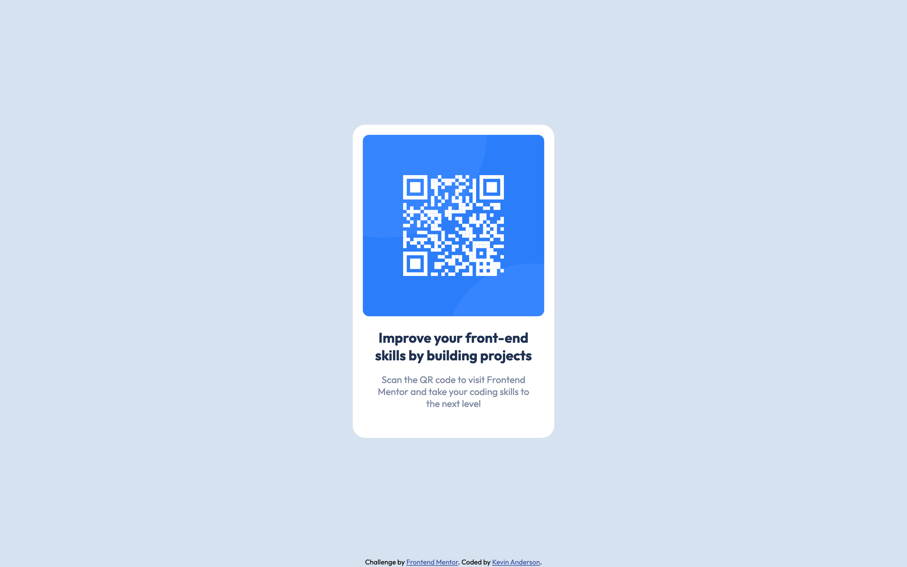

# Frontend Mentor - QR code component solution

This is a solution to the [QR code component challenge on Frontend Mentor](https://www.frontendmentor.io/challenges/qr-code-component-iux_sIO_H). Frontend Mentor challenges help you improve your coding skills by building realistic projects.

## Table of contents

- [Overview](#overview)
  - [Screenshot](#screenshot)
  - [Links](#links)
- [My process](#my-process)
  - [Built with](#built-with)
  - [What I learned](#what-i-learned)
  - [Continued development](#continued-development)
- [Author](#author)
- [Acknowledgments](#acknowledgments)

**Note: Delete this note and update the table of contents based on what sections you keep.**

## Overview

### Screenshot

### Links

- Solution URL: [https://github.com/kevincanderson/FMLP001_qr-code-component-main](https://github.com/kevincanderson/FMLP001_qr-code-component-main)
- Live Site URL: [https://kevincanderson.github.io/FMLP001_qr-code-component-main/](https://kevincanderson.github.io/FMLP001_qr-code-component-main/)

## My process

For this project I used a basic container div to hold the contents of the qr code and text. This allowed me to position it where it needed to go. Inside that I used another div to contain the QR code image, that way I could control the size of that box easily.

### Built with

- Semantic HTML5 markup
- CSS custom properties
- Flexbox
- Mobile-first workflow

### What I learned

I learned that putting an image inside of a div will allow you a little more control.

### Continued development

My continued learning will be to maintain focus and keep pressing on. I have been dabbling with front end for a bit, but need to continue to stay on track.

## Author

- Website - [Kevin Anderson](https://www.kevincanderson.dev)
- Frontend Mentor - [@kevincanderson](https://www.frontendmentor.io/profile/kevincanderson)
- Twitter - [@_andersonkevin_](https://www.twitter.com/_andersonkevin_)

## Acknowledgments

Thanks to Frontend Mentor and the community for being here.
